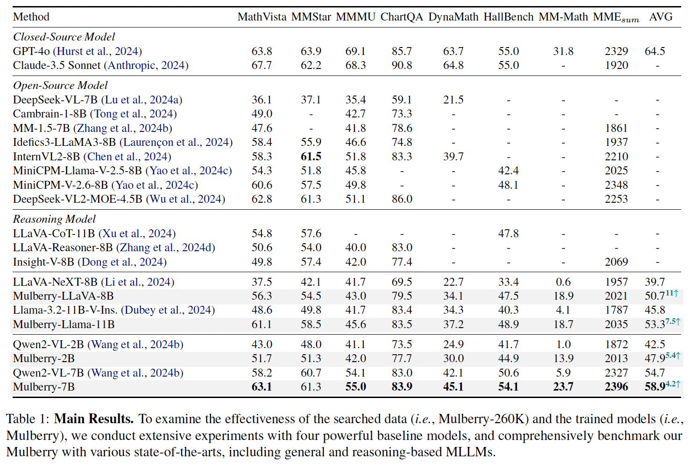
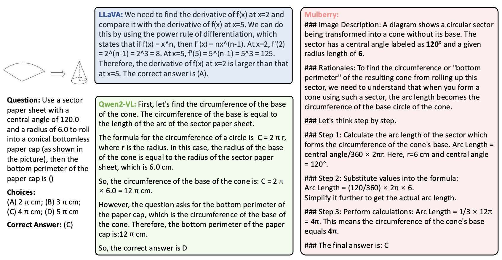

<div align="center">

<h1>  Mulberry: Empowering MLLM with o1-like Reasoning and Reflection via Collective Monte Carlo Tree Search </h1>


</div>

## Reasoning Inference
We provide the inference code for running Mulberry models, which can output detailed step-by-step reasoning.

```bash
python infer.py \
--model 'Mulberry_llava_8b' \
--model_path '<Your_Model_Path>' \
--question 'Question: <Your_Question>' \
--img_path '<Your_Img_Path>' 
```


<details>
<summary>You can also run the following command if you only require the final answer.</summary>

```bash
python infer.py \
--model 'Mulberry_llava_8b' \
--model_path '<Your_Model_Path>' \
--question 'Question: <Your_Question>' \
--img_path '<Your_Img_Path>' \
--only_output_final_answer
```

</details>

## Data Constrution with CoMCTS
We release **CoMCTS Code** for generating reasoning and reflection data, which leverage collective knowledge from multiple models to collaboratively conjecture, search and identify effective reasoning paths toward correct answers via four iterative operations including Expansion, Simulation and Error Positioning, Backpropagation, and Selection.

Please refer comcts directory for more details.

## Training
We use LLaMA-Factory to fine-tune the Mulberry models. We provide the training instructions and configs here.

First, install LLaMA-Factory according to the official instruction.

Then, refer official instruction and update the following customized dataset into `dataset_info.json` in LLaMA-Factory.
```bash
"mulberry": {
    "file_name": "./mulberry_sft.json",
    "formatting": "sharegpt",
    "columns": {
      "messages": "messages",
      "images": "images"
    },
    "tags": {
      "role_tag": "role",
      "content_tag": "content",
      "user_tag": "user",
      "assistant_tag": "assistant"
    }
  },
```

Finally, you can use the following command to train the models.
```bash
llamafactory-cli train examples/train_full/mulberry_llava_8b_full_sft.yaml
```

## Evaluation
We use VLMEvalKit to evaluate the Mulberry models on different benchmarks. We provide the evaluation instructions and key code here.

First, you need to install VLMEvalKit according to the official instructions.

Next, replace the `llava.py` file in `VLMEvalKit-main/vlmeval/vlm/llava/` with the `llava.py` file we provide evaluation directory.

Finally, you can use the following command to perform the evaluation.
```bash
python run.py --data MathVista_MINI --model llava_next_llama3 --verbose
```


## Main Results

We conduct extensive experiments with four powerful baseline models, including LLaVA-Next-8b, LLaMA-3.2-Vision-11B-Instruct, Qwen2-VL-2B and Qwen2-VL-7B. The **Main Results** comparing the Mulberry models with other state-of-the-art models across several popular benchmarks are shown in the figure below.

<div align=center>

</div>


## Quantitative Results
Mulberry creates rich, explicit and well-defined reasoning steps with comprehensive understanding, ultimately arriving at the correct answer.
<div align=center>

</div>


## Limitations
Mulberry is a preliminary exploration work in o1-like MLLM, leveraging Collective Monte Carlo Tree Search to enable effective and efficient reasoning-path searching and learning. 
CoMCTS leverages collective knowledge to significantly improve the search success rate and efficiency of reasoning path searches.
By training on the reasoning data generated through CoMCTS, Mulberry has gained step-by-step reasoning capabilities, leading to a substantial improvement in overall performance.
Nevertheless, certain limitations must be acknowledged.

Hallucinations in intermediate steps: Hallucinations are still prevalent in MLLMs, whether in closed or open-source models.
For instance, the models may generate obvious errors in intermediate reasoning steps yet still arrive at the correct final answer in CoMCTS.
Therefore, although we incorporated multiple models to better detect errors, some errors still persist in the intermediate steps because ensuring the correctness of all intermediate steps often requires human checks, which is extremely costly and unaffordable for us.

Error localization: 
During our experiments, we observed that models struggle to detect their own errors. To address this, CoMCTS employs multiple models to cross-check each other's errors.
However, our findings also revealed that smaller models often fail to generate effective detection responses, while larger models occasionally exhibit inaccurate error localization.
Thus, inaccurate localization may impact the efficiency of the search and we recommend using larger models for error localization or exploring better prompts to enable smaller models to localize errors more accurately.

